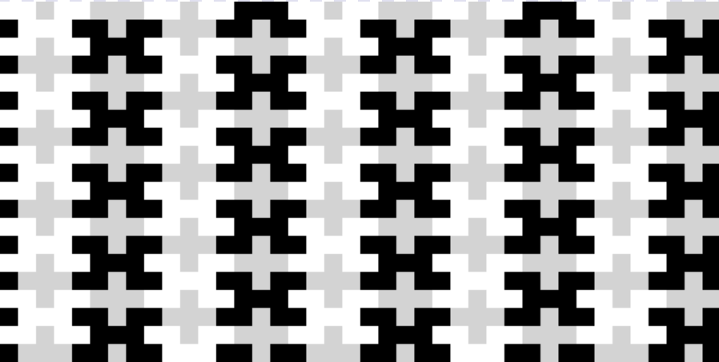
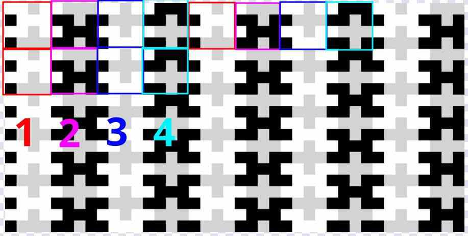
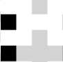
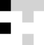

# Tesselation

A javascript program using the HTML5 Canvas API which generates a tesselation
created by David "DavidH" Houlton using constinuent square tiles.

## "4 Tiles" interpretation

## Creating the Tesselation

To create the tesselation algorithmically requires a few steps:

### 1. Start with the repeating pattern

You can repeat this image to create the pattern, but on adjacent pieces
the colours must be changed and the rows must be rotated.

### 2. In the next column, rotates rows

What was the bottom row is ow the top row.

### 3. Change colors to correspond to neighbouring cells

To make our next column have the correct colours to go immediately beside
the image we started with, the two black squares must be white and the white
squares must be black. The "plus" tile remans gray in every case.

